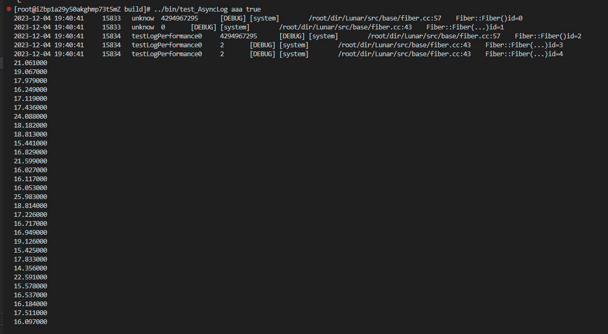

# V0.0.2
**本项目搭建的服务器运行在：[网址](47.99.79.135:8090/index)**
## 更新点  --2023.7.3
1. 实现了一下对日志的配置。
2. 参考Muduo，对Thread模块的封装进行了改进与完善。
3. 对于Fiber模块，在所有从当前协程切换到其他协程的操作中使用裸指针切换，解决了临时智能指针占用引用计数导致Fiber对象无法释放的问题。
4. 对于Mutex模块，对pthread_mutex_lock相关的操作函数增加了断言操作，并发现程序析构时发生段错误。
5. Schedule::run()函数中对取任务/协程操作进行了封装，封装成takeTask成员函数。通过排查，在run函数结束时，将t_scheduler赋值为nullptr，并且调用set_hook_enable(false)，解除hook，4中描述的段错误问题被解决。
6. IOManager::idle()中利用(EPOLLIN | EPOLLOUT) & fdctx->m_events) 掩码读取epoll触发的事件，消除了m_penddingEventCount--可能为负的潜在bug。
7. Timer类中增加了必要的断言。

## 更新点 --2023.12.1
1. 增加了基于协程的信号量，为后续实现协程异步日志打基础。
2. 发现了之前编译出现"class “xxxx“ does not name a type"错误的原因，类的设计存在循环引用的问题，目前暂时使用指针解决，待后面将解决方案完善。

## 更新点 --2023.12.4
1. 实现了基于协程的异步日志，将日志的输出效率提升了近一倍。
    - 同步日志性能测试如下：
    
    - 异步日志性能测试如下：
    
2. 后面计划优化服务器的性能，然后实现一些简单的负载均衡、orm、rock等模块。